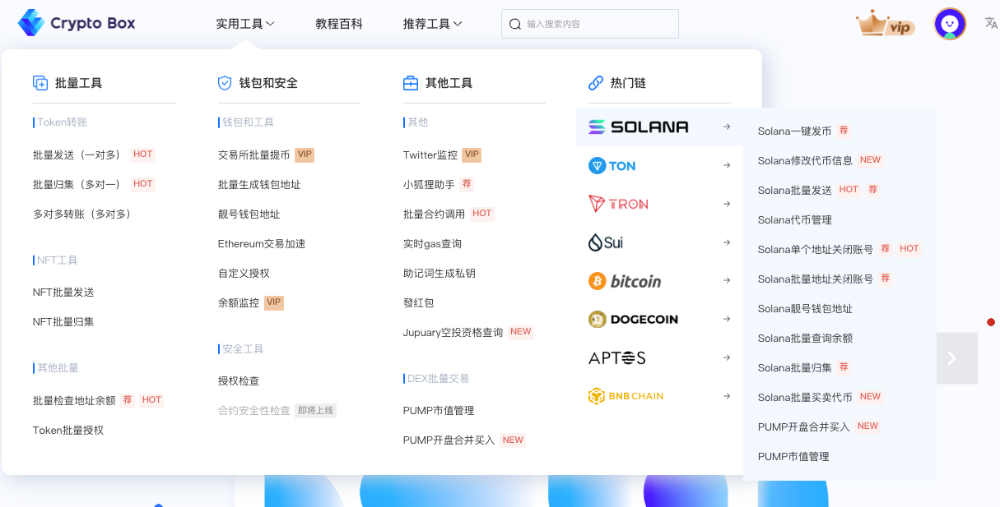

# CPBOX 导航

CPBOX 是业内领先的 Web3.0 多链工具平台，致力于通过全可视化界面简化区块链操作，让用户无需编程即可安全、轻松地完成发币、流动性管理等复杂过程。我们已支持 Ethereum、BSC、Solana、TRON、BASE、SUI、TON 等数十个主流区块链网络，功能覆盖基于 EVM 架构的所有 Layer1 和 Layer2 网络，为 Web3 生态用户提供全方位的实用工具。

快速进入 CPBOX 官网：[https://www.cpbox.io](https://www.cpbox.io/cn/)

---

## 多号批量工具（撸毛工具）

- **[批量钱包创建](https://www.cpbox.io/cn/batch/generate-wallet)**：快速建立多账号，实现多号撸毛｜[查看教程](https://docs.cpbox.io/xiao-bai-bi-kan-xi-lie/pi-liang-di-zhi-sheng-cheng.html)
- **[交易所批量提币](https://www.cpbox.io/cn/exchange/withdraw)**：批零提币，防女巫检测｜[查看教程](https://docs.cpbox.io/shi-yong-gong-ju/jiao-yi-suo-pi-liang-ti-bi.html)
- **[批量归集](https://www.cpbox.io/cn/batch/collection)**：快速整理钱包余额｜[查看教程](https://docs.cpbox.io/pi-liang-gong-ju/pi-liang-gui-ji.html)
- **[批量地址余额查询](https://www.cpbox.io/cn/batch/check-balance)**：快速查询，确认钱包收获｜[查看教程](https://docs.cpbox.io/pi-liang-gong-ju/pi-liang-cha-xun.html)
- **[批量授权](https://www.cpbox.io/cn/batch/approve)**：一次性为多个钱包提前批量授权合约｜[查看教程](https://www.cpbox.io/articles/cn/2830.html)
- **[批量合约调用](https://www.cpbox.io/cn/batch/call-contract)**：灵活调用合约，实现多个地址 mint token 或 NFT，批量 swap 等高级操作｜[查看教程](https://www.cpbox.io/articles/cn/2871.html)
- **[批量助记词导出私钥](https://www.cpbox.io/cn/mnemonic)**：灵活快速导出多组 HD 钱包私钥｜[查看教程]()
- **[MetaMask 助手](https://www.cpbox.io/cn/twitter/bind)**：热门新链快速添加到钱包，撸毛快人一步|[查看教程]()

---

## NFT 工具

- **[NFT 一对多批量发送](https://www.cpbox.io/cn/batch/send-nft)**：一对多，将主钱包中的 NFT 发送至多个子钱包｜[查看教程](https://www.cpbox.io/articles/cn/2837.html)
- **[NFT 归集](https://www.cpbox.io/cn/batch/collection-nft)**：一键查询所有地址 NFT 列表，将多个子钱包中的 NFT 归集到一个主钱包｜[查看教程](https://www.cpbox.io/articles/cn/2835.html)

---

## 扫链工具（监控工具）

- **[聪明钱地址监控教程](https://www.cpbox.io/cn/balance/monitor)**：巨鲸地址余额监控，紧跟聪明钱｜[查看教程](https://docs.cpbox.io/shi-yong-gong-ju/yuejian-kong.html)
- **[推特监控教程](https://www.cpbox.io/cn/twitter/group)**：快速获取市场一线信息，快人一步买入｜[查看教程](https://docs.cpbox.io/shi-yong-gong-ju/twitter-jian-kong.html)
- **[gas 实时监控](https://www.cpbox.io/cn/gas)**：链上网络 gas 实时监控，发现链上交易异动｜[查看教程]()

---

## 批量转账（空投）

- **[EVM 链批量发送教程](https://www.cpbox.io/cn/batch/send-token)**：批量发送，快速实现多钱包买入卖出｜[查看教程](https://docs.cpbox.io/pi-liang-gong-ju/pi-liang-fa-song.html)
- **[Solana 链批量发送教程](https://www.cpbox.io/cn/solana/batch/send)**：实现 Sol 链快速转账或发送 MEME 空投｜[查看教程](https://www.cpbox.io/articles/cn/2841.html)
- **[Ton 链批量发送教程](https://www.cpbox.io/cn/ton/batch-send-token)**：实现 Ton 链快速转账或发送代币空投｜[查看教程]()
- **[Sui 链批量发送教程](https://www.cpbox.io/cn/sui/batch-send-token)**：实现 Sui 链快速转账或发送代币空投｜[查看教程]()

---

## Solana 一键发币

- **[Solana 一键发币](https://www.cpbox.io/cn/solana/token/publish)**：全网最丝滑的 Solana 一键发币平台｜[查看教程](https://docs.cpbox.io/solana-gong-ju/solana-yi-jian-fa-bi.html)
- **[Solana 批量转账](https://www.cpbox.io/cn/solana/batch/send)**：Solana 批量转账/空投代币、以及 Sol 本币｜[查看教程]()
- **[Solana 批量归集](https://www.cpbox.io/cn/solana/batch/collection)**：支持多个钱包内的代币批量归集｜[查看教程]()
- **[Solana 租金回收](https://www.cpbox.io/cn/solana/close-account)**：地址单个或批量回收租金，隐藏收入｜[查看教程](https://docs.cpbox.io/solana-gong-ju/solana-guan-bi-di-zhi-zu-jin-hui-shou.html)
- **[Solana 创建钱包](https://www.cpbox.io/cn/batch/generate-wallet)**：批量生成 Solana 钱包，1 分钟生成几千个｜[查看教程](https://docs.cpbox.io/lian-gong-ju/solana-gong-ju/solana-qian-bao-pi-liang-chuang-jian.html)
- **[PUMP 绑定买入](https://www.cpbox.io/cn/solana/pump/publish)**：发币上 pump.fun，支持多地址捆绑买入｜[查看教程](https://docs.cpbox.io/solana-gong-ju/pump-kai-pan-he-bing-mai-ru.html)
- **[PUMP 市值管理](https://www.cpbox.io/cn/solana/bmm?id=3)**：pump.fun 内盘代币批量交易，市值管理机器人｜[查看教程](https://docs.cpbox.io/solana-gong-ju/pump-shi-zhi-guan-li.html)
- **[PUMPSWAP 加池子](https://swap.pump.fun/?input=So11111111111111111111111111111111111111112)**：pumpfun 最新上线 dex，无需繁琐操作交易｜[查看教程](https://docs.cpbox.io/lian-gong-ju/solana-gong-ju/pumpswap-liu-dong-xing-tian-jia.html)

---

## Ton 一键发币

- **[Ton 一键发币](https://www.cpbox.io/cn/ton/token/publish)**：全网最好用的 TON 一键发币平台｜[查看教程](https://docs.cpbox.io/ton-lian-gong-ju/ton-lian-yi-jian-fa-bi-0-dai-ma-fa-bi.html)
- **[Ton 代币修改](https://www.cpbox.io/cn/ton/token/manage)**：修改创建代币的信息及权限｜[查看教程](https://docs.cpbox.io/ton-lian-gong-ju/ton-dai-bi-guan-li.html)
- **[Dudest 加池子](https://dedust.io/)**：Ton 链第二大 DEX，兼容 EVM，满足跨链需求交易｜[查看教程](https://docs.cpbox.io/ton-lian-gong-ju/ton-liu-dong-xing-chi-chuang-jian-dedust-jiao-cheng.html)
- **[Ston.Fi 加池子](https://ston.fi/)**：TON 链上最大的 DEX，为你的代币创建流动性｜[查看教程]()
- **[Ton 钱包创建](https://www.cpbox.io/cn/batch/generate-wallet)**：最保姆级的 ton 钱包创建教程｜[查看教程]()

---

## Sui 一键发币

- **[Sui 一键发币](https://www.cpbox.io/cn/sui/token/publish)**：全网最好用的 Sui 一键发币平台｜[查看教程](https://docs.cpbox.io/sui-lian-gong-ju/sui-yi-jian-fa-bi.html)
- **[Sui 代币修改](https://www.cpbox.io/cn/sui/token/manage)**：修改创建代币的信息及权限｜[查看教程](https://docs.cpbox.io/sui-lian-gong-ju/sui-dai-bi-quan-xian-xiu-gai.html)
- **[Cetus 加池子](https://www.cetus.zone/)**：SUI 区块链生态里最大的去中心化交易所 DEX ｜[查看教程](https://docs.cpbox.io/sui-lian-gong-ju/sui-liu-dong-xing-chi-tian-jia.html)

---

CPBOX 的愿景是成为 Web3 世界中最可靠、最易用的区块链工具平台，我们致力于通过技术创新降低 Web3 的使用门槛，让更多用户能够安全、便捷地参与区块链经济。

我们相信区块链技术将重塑全球数字经济的未来，CPBOX 将继续站在技术前沿，为用户提供最实用、最安全的区块链工具，共同推动 Web3 生态系统的繁荣发展。

## 联系我们

- **Twitter/X**：[@cpbox](https://x.com/cpbox)
- **官网**：[www.cpbox.io](www.cpbox.io)
- **Telegram**：[t.me/cpbox](https://t.me/cpbox)
- **GitHub**：[github.com/cpbox](https://github.com/cpbox)
