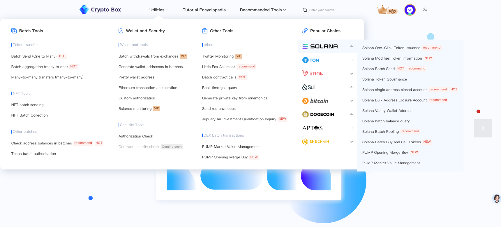

🌐 [中文](../README.md) | English 🌐

# CPBOX Navigation

CPBOX is the industry's leading Web3.0 multi-chain tool platform, dedicated to simplifying blockchain operations through a fully visual interface, allowing users to safely and easily complete complex processes such as coin issuance and liquidity management without programming. We have supported dozens of mainstream blockchain networks such as Ethereum, BSC, Solana, TRON, BASE, SUI, TON, etc., and our functions cover all Layer1 and Layer2 networks based on the EVM architecture, providing a full range of practical tools for Web3 ecosystem users.

Quickly enter the CPBOX official website: [https://www.cpbox.io](https://www.cpbox.io/cn/)

---

## Multi-account batch tool (money-pulling tool)

- **[Batch wallet creation](https://www.cpbox.io/cn/batch/generate-wallet)**: Quickly create multiple accounts and realize multi-account money-pulling ｜[View tutorial](https://docs.cpbox.io/xiao-bai-bi-kan-xi-lie/pi-liang-di-zhi-sheng-cheng.html)
- **[Exchange batch withdrawal](https://www.cpbox.io/cn/exchange/withdraw)**: Wholesale and retail withdrawal, anti-witch detection ｜[View tutorial](https://docs.cpbox.io/shi-yong-gong-ju/jiao-yi-suo-pi-liang-ti-bi.html)
- **[Batch collection](https://www.cpbox.io/cn/batch/collection)**: Quickly sort out wallet balances ｜[View tutorial](https://docs.cpbox.io/pi-liang-gong-ju/pi-liang-gui-ji.html)
- **[Batch address balance query](https://www.cpbox.io/cn/batch/check-balance)**: Quickly query and confirm wallet gains ｜[View tutorial](https://docs.cpbox.io/pi-liang-gong-ju/pi-liang-cha-xun.html)
- **[Batch authorization](https://www.cpbox.io/cn/batch/approve)**: Batch authorize contracts for multiple wallets in advance at one time ｜[View tutorial](https://www.cpbox.io/articles/cn/2830.html)
- **[Batch contract call](https://www.cpbox.io/cn/batch/call-contract)**: Flexible contract call to achieve multiple addresses mint token or NFT, batch swap Advanced operations like [View tutorial](https://www.cpbox.io/articles/cn/2871.html)
- **[Batch mnemonic export private key](https://www.cpbox.io/cn/mnemonic)**: Flexible and fast export of multiple sets of HD wallet private keys
- **[MetaMask helper](https://www.cpbox.io/cn/metamask/helper)**: Quickly add popular new chains to the wallet, and get one step faster

---

## NFT tools

- **[NFT one-to-many batch sending](https://www.cpbox.io/cn/batch/send-nft)**: One-to-many, send NFTs in the main wallet to multiple sub-wallets ｜[View tutorial](https://www.cpbox.io/articles/cn/2837.html)
- **[NFT Collection](https://www.cpbox.io/cn/batch/collection-nft)**: One-click query of all address NFT lists, collect NFTs in multiple sub-wallets into one main wallet ｜[View tutorial](https://www.cpbox.io/articles/cn/2835.html)

---

## Chain sweep tool (monitoring tool)

- **[Smart money address monitoring tutorial](https://www.cpbox.io/cn/balance/monitor)**: Monitor the balance of whale addresses and keep up with smart money ｜[View tutorial](https://docs.cpbox.io/shi-yong-gong-ju/yuejian-kong.html)
- **[Twitter monitoring tutorial](https://www.cpbox.io/cn/twitter/group)**: Quickly obtain market front-line information and buy faster than others ｜[View tutorial](https://docs.cpbox.io/shi-yong-gong-ju/twitter-jian-kong.html)
- **[gas Real-time monitoring](https://www.cpbox.io/cn/gas)**: Real-time monitoring of on-chain network gas, and detection of abnormal transactions on the chain

---

## Batch transfer (airdrop)

- **[EVM chain batch sending tutorial](https://www.cpbox.io/cn/batch/send-token)**: Batch sending, fast multi-wallet buying and selling ｜[View tutorial](https://docs.cpbox.io/pi-liang-gong-ju/pi-liang-fa-song.html)
- **[Solana chain batch sending tutorial](https://www.cpbox.io/cn/solana/batch/send)**: Realize Sol chain fast transfer or send MEME airdrop ｜[View tutorial](https://www.cpbox.io/articles/cn/2841.html)
- **[Ton Batch Sending Tutorial](https://www.cpbox.io/cn/ton/batch-send-token)**: Realize fast transfer or token airdrop on Ton chain
- **[Batch Sending Tutorial on Sui chain](https://www.cpbox.io/cn/sui/batch-send-token)**: Realize fast transfer or token airdrop on Sui chain

---

## Solana One-click Coin Issuance

- **[Solana One-click Coin Issuance](https://www.cpbox.io/cn/solana/token/publish)**: The smoothest Solana one-click coin issuance platform in the whole network ｜[View Tutorial](https://docs.cpbox.io/solana-gong-ju/solana-yi-jian-fa-bi.html)
- **[Solana Batch transfer](https://www.cpbox.io/cn/solana/batch/send)**: Solana batch transfer/airdrop tokens, and Sol native currency ｜[View tutorial](https://www.cpbox.io/articles/cn/2841.html)
- **[Solana batch collection](https://www.cpbox.io/cn/solana/batch/collection)**: Support batch collection of tokens in multiple wallets ｜[View tutorial](https://www.cpbox.io/articles/cn/2857.html)
- **[Solana rent recovery](https://www.cpbox.io/cn/solana/close-account)**: Single or batch recovery of rent, hidden income ｜[View tutorial](https://docs.cpbox.io/solana-gong-ju/solana-guan-bi-di-zhi-zu-jin-hui-shou.html)
- **[Solana create wallet](https://www.cpbox.io/cn/batch/generate-wallet)**: Batch generate Solana wallets, 1 Generate thousands of them in minutes ｜[View tutorial](https://docs.cpbox.io/lian-gong-ju/solana-gong-ju/solana-qian-bao-pi-liang-chuang-jian.html)
- **[PUMP binding purchase](https://www.cpbox.io/cn/solana/pump/publish)**: Issue coins on pump.fun, support multi-address bundled purchase ｜[View tutorial](https://docs.cpbox.io/solana-gong-ju/pump-kai-pan-he-bing-mai-ru.html)
- **[PUMP market value management](https://www.cpbox.io/cn/solana/bmm?id=3)**: pump.fun internal token batch trading, market value management robot ｜[View tutorial](https://docs.cpbox.io/solana-gong-ju/pump-shi-zhi-guan-li.html)
- **[PUMPSWAP Add to pool](https://swap.pump.fun/?input=So1111111111111111111111111111111111111112)**: pumpfun is newly launched on dex, no need for tedious operations and transactions ｜[View tutorial](https://docs.cpbox.io/lian-gong-ju/solana-gong-ju/pumpswap-liu-dong-xing-tian-jia.html)

---

## Ton one-click coin issuance

- **[Ton one-click coin issuance](https://www.cpbox.io/cn/ton/token/publish)**: The best TON one-click coin issuance platform in the entire network ｜[View tutorial](https://docs.cpbox.io/ton-lian-gong-ju/ton-lian-yi-jian-fa-bi-0-dai-ma-fa-bi.html)

- **[Ton Token modification](https://www.cpbox.io/cn/ton/token/manage)**: Modify the information and permissions of creating tokens ｜[View tutorial](https://docs.cpbox.io/ton-lian-gong-ju/ton-dai-bi-guan-li.html)
- **[Dudest add pool](https://dedust.io/)**: The second largest DEX on the TON chain, compatible with EVM, to meet cross-chain transaction needs ｜[View tutorial](https://docs.cpbox.io/ton-lian-gong-ju/ton-liu-dong-xing-chi-chuang-jian-dedust-jiao-cheng.html)
- **[Ston.Fi add pool](https://ston.fi/)**: The largest DEX on the TON chain, create liquidity for your tokens
- **[Ton wallet creation](https://www.cpbox.io/cn/batch/generate-wallet)**: The most nanny-level ton Wallet creation tutorial

---

## Sui one-click coin issuance

- **[Sui one-click coin issuance](https://www.cpbox.io/cn/sui/token/publish)**: The best Sui one-click coin issuance platform in the entire network ｜[View tutorial](https://docs.cpbox.io/sui-lian-gong-ju/sui-yi-jian-fa-bi.html)
- **[Sui token modification](https://www.cpbox.io/cn/sui/token/manage)**: Modify the information and permissions of creating tokens ｜[View tutorial](https://docs.cpbox.io/sui-lian-gong-ju/sui-dai-bi-quan-xian-xiu-gai.html)
- **[Cetus pool addition](https://www.cetus.zone/)**: The largest decentralized exchange DEX in the SUI blockchain ecosystem ｜[View tutorial](https://docs.cpbox.io/sui-lian-gong-ju/sui-liu-dong-xing-chi-tian-jia.html)

---

## CPBOX Web3 News

- **[Tutorials](https://blog.cpbox.io/category/exercise-en/)**：Our Web3 tutorials cover hands-on skills such as creating crypto wallets, interacting with blockchains, using DeFi protocols, minting and trading NFTs, smart contract programming, and decentralized application (dApp) development. Through step-by-step examples and real-world use cases, learners will gain practical knowledge of blockchain technologies and industry best practices.
- **[Market Trends](https://blog.cpbox.io/category/market-en/)**：Web3 market trends provide real-time analysis of price movements, investment flows, project developments, and regulatory changes across blockchain, cryptocurrency, DeFi, and NFT sectors. These updates reflect the evolving dynamics of the decentralized digital economy and highlight emerging opportunities for investors and builders.
- **[Ecosystem](https://blog.cpbox.io/category/ecology-en/)**：The Web3 ecosystem represents the evolution of a decentralized internet built on blockchain technology. It emphasizes user ownership of data, transparency, and peer-to-peer interactions without intermediaries. Key components include cryptocurrencies, smart contracts, DeFi protocols, NFTs, and other innovative applications driving the shift toward a trustless digital economy.
- **[Market Analysis](https://blog.cpbox.io/category/analysis-en/)**：Our Web3 market analysis focuses on evaluating blockchain project valuations, token price trends, user growth metrics, total value locked (TVL), developer activity, governance proposals, and regulatory developments. These insights help reveal the investment value, technological innovation, and emerging trends in the decentralized ecosystem.

---

CPBOX's vision is to become the most reliable and easy-to-use blockchain tool platform in the Web3 world. We are committed to lowering the threshold for using Web3 through technological innovation, so that more users can participate in the blockchain economy safely and conveniently.

We believe that blockchain technology will reshape the future of the global digital economy. CPBOX will continue to stand at the forefront of technology, provide users with the most practical and secure blockchain tools, and jointly promote the prosperity and development of the Web3 ecosystem.

---

## Contact Us

- **Twitter/X**：[@cpbox](https://x.com/cpbox)
- **Official Website**：[www.cpbox.io](www.cpbox.io)
- **Telegram**：[t.me/cpbox](https://t.me/cpbox)
- **GitHub**：[github.com/cpbox](https://github.com/cpbox)
